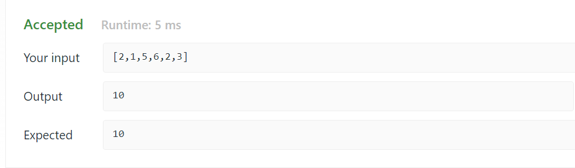

<h2><a href="https://leetcode.com/problems/largest-rectangle-in-histogram/">Largest Rectangle in Histogram</a></h2><h3>Hard</h3>

## Table of contents

- [Overview](#overview)
- [Approach](#approach)
- [Screenshot](#screenshot)
- [References](#references)

## Overview 

Given an array of integers <code>heights</code>representing the histogram's bar height where the width of each bar is <code>1</code>, return the area of the largest rectangle in the histogram.

&nbsp;

<strong class="example">Example 1:</strong>

<pre><strong>Input:</strong> heights = [2,1,5,6,2,3]
<strong>Output:</strong> 10
<strong>Explanation:</strong> he above is a histogram where width of each bar is 1.
The largest rectangle is shown in the red area, which has an area = 10 units.
</pre>

<strong class="example">Example 2:</strong>

<pre><strong>Input:</strong> heights = [2,4]
<strong>Output:</strong> 4
</pre>

&nbsp;

<strong>Constraints:</strong>

<ul>
	<li><code>1 &lt;= heights.length &lt;= 105 </code></li>
	<li><code>0 &lt;= heights[i] &lt;= 104</code></li>
</ul>

## Approach

&nbsp;

<h3>Brute Force</h3>
<ul>
    <li>Let's Intialize a variable <code>MaxArea=0</code> which will track the maximum area of the rectangle in histogram</li>
    <li>Run nested for loops , first from <code>i=0</code> till <code>i=N</code> and second from <code>j=i</code> to <code>j=N</code> where <code>N</code> is number of bars in histogram</li>
    <li>For each jth iteration , again run a for loop from <code>k=i</code> to <code>k=j</code> and find the height of minimum bar among them.</li>
    <li>Area of the histogram will obtained as <code>MinHeight*(j-i+1)</code>.</li>
    <li>Then compare the Area with <code>MaxArea</code>, maximum out of them will be assigned to MaxArea</li>
</ul>

<strong>Time Complexity:</strong>O(n3)

<strong>Space Complexity:</strong>O(1)

<h3>Using Stack</h3>

<h4><strong>Step 1:</strong> Implementation of function to find the previous smallest element's index</h4>
<ul>
<li>Initialize array of same size as heights, let's name it result</li>
<li>Initialize stack st</li>
<li>Traverse the array heights using for loop from<code>i=0</code> to <code>N-1</code>.</li>
<li>if stack is not empty and for each ith iteration <code>heights[i]</code> is smaller than or equal to the <code>heights[st.top()]</code> then pop the element from stack</li>
<li>if the stack is empty than set <code>result[i]=-1</code></li>
<li>else set <code>result[i]=st.top()</code></li>
<li> for each ith iteration push the value <code>i</code> into stack</li>
<li> Return the result array</li>
</ul>

<h4><strong>Step 2:</strong> Implementation of function to find the next smallest element's index</h4>
<ul>
<li>Initialize array of same size as heights, let's name it result<li>
<li>Initialize stack st</li>
<li>Traverse the array heights using for loop, from <code>i=N-1</code> to <code>i=0</code></li>
<li>if stack is not empty and for each ith iteration <code>heights[i]</code> is smaller than or equal to the <code>heights[st.top()]</code> then pop the element from stack</li>
<li>if the stack is empty than set <code>result[i]=N</code> where <code>N</code> is the size of heights array</li>
<li>else set <code>result[i]=st.top()</code></li>
<li> for each ith iteration push the value <code>i</code> into stack</li>
<li> Return the result array</li>
</ul>

<h4><strong>Step 3:</strong> Implementation of function to find the largest Rectangle Area in histogram</h4>
<ul>
   <li> get the previous smallest array <code>PS</code> and next smallest array <code>NS</code> from step-1 and step-2</li>
   <li>intialize the <code>largestArea=0</code>, it will track the largest Area of rectangle in histogram</li>
   <li>Traverse the height array using for loop</li>
   <li>The Area at ith bar is <code>NS[i]-PS[i]-1</code></li>
   <li>Maximize the <code>largestArea</code></li>
</ul>

<strong>Time Complexity:</strong>O(3n) that can be considered as O(n)

<strong>Space Complexity:</strong>O(n)

<h3> Using Stack in single pass </h3>
<ul>
	<li>Intialize an empty stack</li>
	<li>Iterarte the heights of bar for the given steps</li>
	(i) If the stack is empty or heights[i] is higher than the bar at top of stack, then push 'i' to stack.  
	(ii) If the bar is smaller than the top of the stack, then keep removing the top of the stack while the top of the stack is greater.  
	(iii) Then calculate the area of the rectangle and update the maxArea.  
	<li> if the stack is not empty, then one by one remove all bars from the stack and repeat the above steps for every removed bar </li>
</ul>

<strong>Time Complexity:</strong>O(n)

<strong>Space Complexity:</strong>O(n)

## Screenshot

## References
- [Leetcode Discussion](https://leetcode.com/problems/largest-rectangle-in-histogram/discuss/?currentPage=1&orderBy=hot&query=)
- [GeeksForGeeks](https://www.geeksforgeeks.org/largest-rectangular-area-in-a-histogram-using-stack/)
- [InterviewBit](https://www.interviewbit.com/blog/largest-rectangle-in-histogram/)
